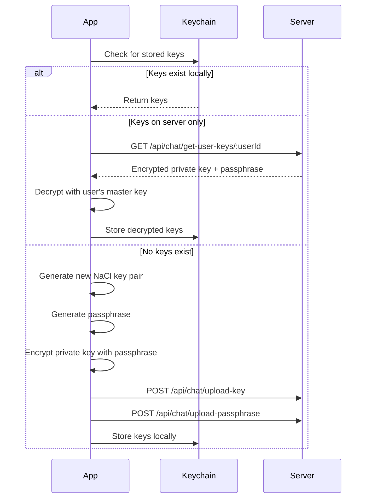

# Trakio (HomeManagerRN) - Project Reference Document

> **Last Updated:** January 12, 2026  
> **Project Type:** React Native Mobile Application  
> **Purpose:** Household expense tracking and management with chat functionality

---

## 📋 Project Overview

**Trakio** is a cross-platform React Native application for managing household expenses, budgets, and shared financial responsibilities. It includes features for expense tracking, financial reporting, real-time chat with end-to-end encryption, and user profile management.

### Key Features

- **Expense Management** – Add, view, filter expenses by category and time period
- **Financial Dashboard** – Charts and reports for spending analysis
- **Budget & Income Tracking** – Set and monitor financial goals
- **Real-time Chat** – End-to-end encrypted messaging with friends
- **PDF Report Generation** – Download expense reports
- **Dark/Light Theme Support** – User preference-based theming
- **Google Sign-In** – Social authentication option

---

## 🛠 Technology Stack

| Category             | Technology                             | Version |
| -------------------- | -------------------------------------- | ------- |
| **Framework**        | React Native                           | 0.78.1  |
| **React**            | React                                  | 19.0.0  |
| **Language**         | TypeScript                             | 5.0.4   |
| **Navigation**       | React Navigation (Stack + Bottom Tabs) | 7.x     |
| **State Management** | Zustand                                | 5.0.7   |
| **HTTP Client**      | Axios                                  | 1.9.0   |
| **Local Storage**    | AsyncStorage                           | 2.1.2   |
| **Animations**       | React Native Reanimated                | 3.17.5  |
| **Real-time**        | Socket.io Client                       | 4.8.1   |
| **Crypto**           | TweetNaCl + RN Simple Crypto           | -       |
| **Secure Storage**   | React Native Keychain                  | 10.0.0  |

---

## 📂 Project Structure

```
HomeManagerRN/
├── App.tsx                 # Root component with providers
├── index.js                # Entry point
├── package.json            # Dependencies & scripts
├── src/
│   ├── components/         # Reusable UI components (33 items)
│   │   ├── Header.tsx
│   │   ├── ErrorBoundary.tsx
│   │   ├── MonthYearPicker.tsx
│   │   ├── categorySelector.tsx
│   │   ├── accordion/
│   │   ├── accountOptions/
│   │   ├── calendar/
│   │   ├── customTabBar/
│   │   ├── dropdown/
│   │   ├── expenseCard/
│   │   ├── filterButton/
│   │   ├── form/
│   │   ├── icons/          # Custom SVG icons (11 items)
│   │   ├── imageUploader/
│   │   ├── modal/
│   │   ├── paymentMethodSelector/
│   │   ├── rupeeIcon/
│   │   └── tabs/
│   │
│   ├── constants.ts        # App constants (categories, months, friends mock)
│   │
│   ├── hooks/              # Custom React hooks
│   │
│   ├── navigators/         # Navigation configuration
│   │   ├── authorizeStack.tsx      # Authenticated routes
│   │   ├── unauthorizeStack.tsx    # Unauthenticated routes
│   │   ├── bottomTabNavigator.tsx  # Main tab navigation
│   │   └── navigators.tsx
│   │
│   ├── providers/          # Context providers
│   │   ├── AuthProvider.tsx        # Authentication state & methods
│   │   ├── UserContext.tsx         # User data context
│   │   ├── ThemeContext.tsx        # Theme context
│   │   ├── Theme.ts                # Theme definitions (dark/light)
│   │   └── theme.style.tsx
│   │
│   ├── screens/            # Screen components
│   │   ├── home/           # Home dashboard (591 lines)
│   │   ├── dashboard/      # Dashboard placeholder
│   │   ├── expense/        # Expense list with filtering
│   │   ├── addExpense/     # Add new expense form
│   │   ├── chat/           # Chat with E2E encryption
│   │   ├── profile/        # User profile & settings
│   │   ├── signin/         # Sign in screen
│   │   ├── signup/         # Sign up screen
│   │   ├── login/          # Login screen
│   │   ├── onboarding/     # Onboarding flow
│   │   ├── otpVerification/# OTP verification
│   │   └── action/         # Settings actions (income, budget, etc.)
│   │
│   ├── services/
│   │   └── api.ts          # Axios instance with interceptors
│   │
│   ├── store/
│   │   └── index.ts        # Zustand store (chat messages)
│   │
│   ├── types/
│   │   ├── categories.ts
│   │   ├── env.d.ts
│   │   └── iconProps.ts
│   │
│   └── utils/              # Utility functions
│       ├── cryptoUtils.ts  # E2E encryption utilities
│       ├── socket.ts       # Socket.io client
│       ├── amounts.ts      # Currency formatting
│       ├── dates.ts        # Date utilities
│       ├── fileUtil.ts     # File operations & PDF download
│       ├── permissions.ts  # Permission handling
│       ├── deviceInfo.ts   # Device information
│       ├── imagePicker.ts  # Image selection
│       ├── users.ts        # User key storage utilities
│       └── styles.ts       # Common styles
│
├── assets/                 # Static assets (images, fonts)
├── android/                # Android native code
├── ios/                    # iOS native code
└── __tests__/              # Test files
```

---

## 🔐 Authentication System

### Authentication Provider ([AuthProvider.tsx](file:///Users/rishabhparsediya/Desktop/Rishabh/Projects/HomeManagerRN/src/providers/AuthProvider.tsx))

The app uses a context-based authentication system with multiple sign-in methods:

| Method           | Endpoint                            | Description                   |
| ---------------- | ----------------------------------- | ----------------------------- |
| Password Sign In | `POST /api/auth/login`              | Email/password authentication |
| Password Sign Up | `POST /api/auth/signup`             | User registration             |
| Google Sign In   | `POST /api/auth/signin-with-google` | OAuth via Google              |

### User State Shape

```typescript
type UserProps = {
  name: string;
  photoUrl: string;
  userId: string;
  loggedIn: boolean;
  token: string;
  email: string;
  budget: number;
  income: number;
  phoneNumber: string;
  userLoginProvider: string; // 'google' | 'password'
};
```

### Token Storage

- Tokens stored in `AsyncStorage` with keys: `'userId'`, `'token'`
- API interceptor automatically attaches `Authorization: Bearer <token>` header

---

## 🧭 Navigation Architecture

### Conditional Navigation ([App.tsx](file:///Users/rishabhparsediya/Desktop/Rishabh/Projects/HomeManagerRN/App.tsx))

```
RootNavigator
├── isAuthenticated = true  → AuthorizeNavigation
└── isAuthenticated = false → UnauthorizeNavigation
```

### Unauthorized Stack Routes

| Route             | Screen                | Description           |
| ----------------- | --------------------- | --------------------- |
| `Onboarding`      | Onboarding            | Welcome/intro screens |
| `SignIn`          | SignInScreen          | Login form            |
| `Signup`          | SignUpScreen          | Registration form     |
| `OTPVerification` | OtpVerificationScreen | OTP input             |
| `Login`           | Login                 | Alternative login     |

### Authorized Stack Routes

| Route                     | Screen                  | Description              |
| ------------------------- | ----------------------- | ------------------------ |
| `BottomTabNavigator`      | BottomTabNavigator      | Main tab container       |
| `Home`                    | Home                    | Dashboard                |
| `Dashboard`               | Dashboard               | Analytics                |
| `AddExpense`              | AddExpense              | Add expense form         |
| `Chat`                    | ChatScreen              | Friends list             |
| `FriendChat`              | FriendChatScreen        | Individual chat          |
| `Action`                  | ActionScreen            | Income/Budget/Bills edit |
| `EditPersonalInformation` | EditPersonalInformation | Profile edit             |
| `UpdatePassword`          | UpdatePassword          | Password change          |
| `ExportData`              | ExportData              | Data export              |

### Bottom Tab Navigator (5 Tabs)

```
┌───────────────────────────────────────────────────────────────┐
│  Home  │  Expenses  │  Add (+)  │  Chat  │  Profile           │
└───────────────────────────────────────────────────────────────┘
```

---

## 💰 Expense Management

### Expense Categories ([constants.ts](file:///Users/rishabhparsediya/Desktop/Rishabh/Projects/HomeManagerRN/src/constants.ts))

| ID  | Category          | Icon              |
| --- | ----------------- | ----------------- |
| 1   | Food & Dining     | FoodIcon          |
| 2   | Transportation    | TransportIcon     |
| 3   | Shopping          | ShoppingIcon      |
| 4   | Bills & Utilities | BillsIcon         |
| 5   | Entertainment     | EntertainmentIcon |
| 6   | Others            | OthersIcon        |

### Payment Methods

- Cash
- Credit Card
- Debit Card

### Expense API Endpoints

| Method | Endpoint                       | Description              |
| ------ | ------------------------------ | ------------------------ |
| GET    | `/api/expense?filter=<filter>` | Get expenses with filter |
| POST   | `/api/expense`                 | Create new expense       |

### Filters Available

- `All` – All expenses
- `Today` – Today's expenses
- `Week` – This week's expenses
- `Month` – This month's expenses

### Expense Data Shape

```typescript
interface ExpenseDataProps {
  id: string;
  amount: string;
  category: string;
  categoryId: number;
  description: string;
  expenseDate: string;
  paymentMethod: string;
  paymentMethodId: number;
  userId: string;
  createdAt: string;
  updatedAt: string;
}
```

---

## 💬 Chat System with E2E Encryption

### Encryption Architecture ([cryptoUtils.ts](file:///Users/rishabhparsediya/Desktop/Rishabh/Projects/HomeManagerRN/src/utils/cryptoUtils.ts))

The chat system uses **end-to-end encryption** with the following cryptographic primitives:

| Component            | Algorithm             | Library          |
| -------------------- | --------------------- | ---------------- |
| Key Pair             | NaCl box (Curve25519) | TweetNaCl        |
| Key Derivation       | PBKDF2-SHA256         | RN Simple Crypto |
| Symmetric Encryption | AES                   | RN Simple Crypto |
| Secure Storage       | Keychain              | RN Keychain      |

### Key Management Flow



### Crypto Constants

- `PBKDF2_ITERATIONS`: 100,000
- `KEY_LENGTH`: 32 bytes
- `SALT`: `'trakio_salt'`

### Chat Store (Zustand)

```typescript
type Message = {
  id: number;
  sender_id: string | null;
  receiver_id: string;
  message: string; // Encrypted message
  nonce: string;
  sent_at: string;
  plaintext?: string; // Decrypted message
};

type ChatState = {
  chats: Record<string, Message[]>;
  lastMessages: Record<string, string>;
  setMessages: (friendId: string, messages: Message[]) => void;
  addMessage: (friendId: string, message: Message) => void;
  clearMessages: () => void;
};
```

### Chat API Endpoints

| Method | Endpoint                          | Description                 |
| ------ | --------------------------------- | --------------------------- |
| GET    | `/api/chat/getFriends/:userId`    | Get friends list            |
| GET    | `/api/chat/get-user-keys/:userId` | Get user's encrypted keys   |
| POST   | `/api/chat/upload-key`            | Upload encrypted keypair    |
| POST   | `/api/chat/upload-passphrase`     | Upload encrypted passphrase |

---

## 🎨 Theming System

### Theme Provider ([ThemeContext.tsx](file:///Users/rishabhparsediya/Desktop/Rishabh/Projects/HomeManagerRN/src/providers/ThemeContext.tsx))

Supports `'dark'` and `'light'` themes with the following color tokens:

| Token              | Dark Theme   | Light Theme  |
| ------------------ | ------------ | ------------ |
| `background`       | Dark color   | Light color  |
| `text`             | Light text   | Dark text    |
| `primary`          | Accent color | Accent color |
| `tabBarBackground` | Dark tab     | Light tab    |

### Usage Pattern

```typescript
const { theme } = useTheme();
const colors = theme === "dark" ? darkTheme : lightTheme;
```

---

## 📡 API Service ([api.ts](file:///Users/rishabhparsediya/Desktop/Rishabh/Projects/HomeManagerRN/src/services/api.ts))

### Configuration

```typescript
const api = axios.create({
  baseURL: process.env.BASE_URL,
  timeout: 10000,
  headers: { "Content-Type": "application/json" },
});
```

### Interceptors

- **Request**: Auto-attaches `Authorization: Bearer <token>` from AsyncStorage
- **Response**: Handles 401 errors (token expiration)

---

## 🔌 Real-time Communication

### Socket.io Client ([socket.ts](file:///Users/rishabhparsediya/Desktop/Rishabh/Projects/HomeManagerRN/src/utils/socket.ts))

Socket connection is initialized on app startup when user is authenticated:

```typescript
socket.connect();
socket.emit("register", userId);
```

Disconnects on app cleanup.

---

## ⚙️ Environment Configuration

### Environment Files

- `.env.development` – Development API URLs
- `.env.production` – Production API URLs

### Required Variables

| Variable               | Description                   |
| ---------------------- | ----------------------------- |
| `BASE_URL`             | Backend API base URL          |
| `GOOGLE_WEB_CLIENT_ID` | Google OAuth client ID        |
| `ENVIRONMENT`          | `development` or `production` |

---

## 📜 Available Scripts

| Script       | Command                     | Description                       |
| ------------ | --------------------------- | --------------------------------- |
| Start Dev    | `npm start` or `yarn start` | Start Metro bundler (dev)         |
| Start Prod   | `npm run start:prod`        | Start Metro bundler (prod)        |
| Android Dev  | `npm run android-dev`       | Run on Android (dev)              |
| Android Prod | `npm run android-prod`      | Run on Android (prod)             |
| iOS Dev      | `npm run ios-dev`           | Run on iOS (dev)                  |
| iOS Prod     | `npm run ios-prod`          | Run on iOS (prod)                 |
| Clean        | `npm run clean`             | Clean Android build + reset cache |
| Test         | `npm test`                  | Run Jest tests                    |
| Lint         | `npm run lint`              | Run ESLint                        |

---

## 🧪 Testing

- Test runner: **Jest** (v29.6.3)
- Test files location: `__tests__/`
- Run tests: `npm test` or `yarn test`

---

## 📱 Key Screens Overview

### Home Screen ([home/index.tsx](file:///Users/rishabhparsediya/Desktop/Rishabh/Projects/HomeManagerRN/src/screens/home/index.tsx))

- **Lines:** 591
- **Features:** Expense charts, monthly summary, report generation, action buttons (income/bills/budget)
- **API:** `/api/users/me` for user data

### Expense Screen ([expense/index.tsx](file:///Users/rishabhparsediya/Desktop/Rishabh/Projects/HomeManagerRN/src/screens/expense/index.tsx))

- **Lines:** 287
- **Features:** Filterable expense list, month-over-month comparison, pull-to-refresh
- **Components:** ExpenseCard, FilterButton, Header, LinearGradient

### Add Expense Screen ([addExpense/index.tsx](file:///Users/rishabhparsediya/Desktop/Rishabh/Projects/HomeManagerRN/src/screens/addExpense/index.tsx))

- **Lines:** 304
- **Features:** Amount input, category selector, payment method, date picker
- **Components:** CategorySelector, PaymentMethodSelector, DateTimePicker

### Chat Screen ([chat/index.tsx](file:///Users/rishabhparsediya/Desktop/Rishabh/Projects/HomeManagerRN/src/screens/chat/index.tsx))

- **Lines:** 143
- **Features:** Friends list, E2E encryption key initialization
- **Sub-screens:** FriendChat for individual conversations

### Profile Screen ([profile/index.tsx](file:///Users/rishabhparsediya/Desktop/Rishabh/Projects/HomeManagerRN/src/screens/profile/index.tsx))

- **Lines:** 334
- **Features:** User info display, theme toggle, logout, account options
- **Navigation:** Edit profile, update password, export data

---

## 🔗 API Endpoints Summary

### Authentication

- `POST /api/auth/login`
- `POST /api/auth/signup`
- `POST /api/auth/signin-with-google`

### User

- `GET /api/users/me`

### Expense

- `GET /api/expense`
- `POST /api/expense`

### Chat

- `GET /api/chat/getFriends/:userId`
- `GET /api/chat/get-user-keys/:userId`
- `POST /api/chat/upload-key`
- `POST /api/chat/upload-passphrase`

---

## 📝 Development Notes

1. **Google Sign-In Configuration**

   - Requires `GOOGLE_WEB_CLIENT_ID` in environment
   - Configured with `offlineAccess: true` and `forceCodeForRefreshToken: true`

2. **Buffer Polyfill**

   - Global Buffer is polyfilled for crypto operations
   - `react-native-get-random-values` must be imported before crypto libs

3. **Status Bar Handling**

   - Different status bar styles for auth/unauth screens
   - Android-specific translucent handling

4. **Error Boundary**

   - App wrapped in ErrorBoundary with fallback UI
   - Catches and displays user-friendly error messages

5. **Toast Notifications**
   - Uses `react-native-toast-message` for in-app notifications
   - Rendered at NavigationContainer level

---

_This document serves as a comprehensive reference for the Trakio/HomeManagerRN codebase._
